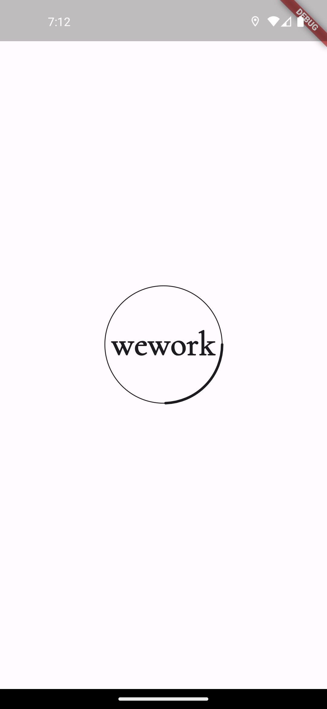
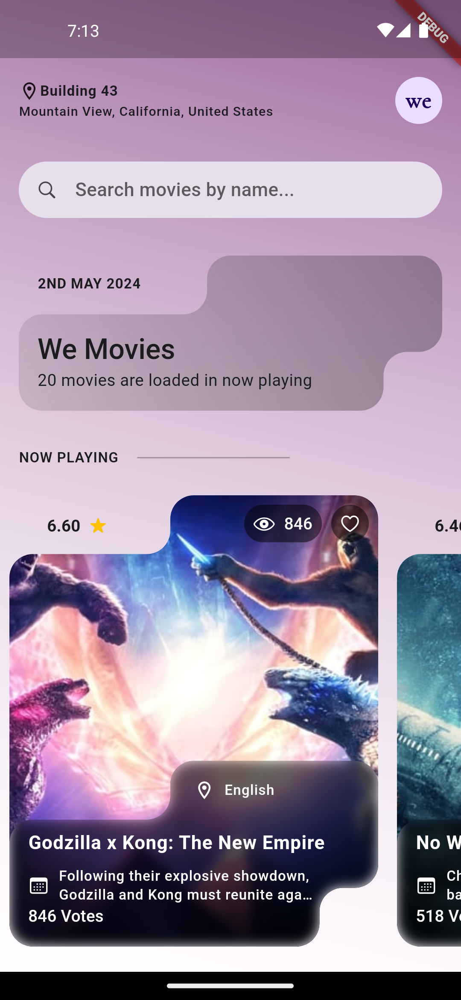

# wework_movies

A flutter app for WeWork

## Getting Started

To get started, you will need to have Flutter installed on your machine. You can find instructions on how to install Flutter [here](https://flutter.dev/docs/get-started/install).


### Get dependencies

```bash
dart pub get
```

### Generate files

```bash
dart run build_runner build --delete-conflicting-outputs
```

### Run the app

```bash
flutter run --dart-define=TMDB_API_KEY=<API-KEY>
```

## Technical Design

[Design Document](./technical_design/DESIGN.md)

## Screenshots




