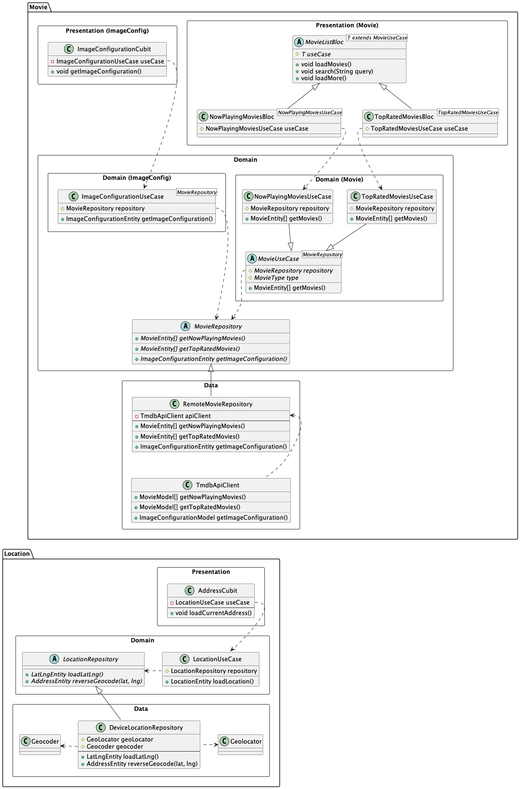

# Technical Design

## Architecture

The movies app is designed using Clean Architecture. The app is divided into three layers: `data`, `domain`,
and `presentation`. A basic class diagram of the app is shown below.

## Libraries

The following libraries have been used to implement the app:

- **Retrofit**: Make network requests to the TMDB API.
- **AutoRoute**: Generate routes for navigation.
- **BlocConcurrency**: Transform events in the BLoC.
- **geocoding**, **geolocator**: Get the user's location and reverse geoode it to get the address
- **HydratedBloc**: Persist / cache the state of the BLoC
- **Freezed**, **JsonSerializable**: Generate code for data classes.
- **Shimmer**: Show loading animations.
